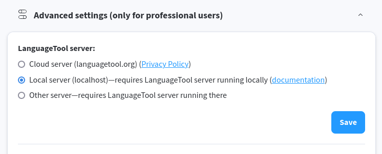

# Eloquent
### Your intelligent proofreading assistant

<a href='https://flathub.org/apps/re.sonny.Eloquent'></a>

---

## 🌟 Overview

**Eloquent** is an advanced proofreading software that supports English, Spanish, French, German, Portuguese, Polish, Dutch, and more than 20 other languages. It finds many errors that a simple spell checker cannot detect, providing comprehensive grammar and style analysis.

The application works fully offline, powered by the robust [LanguageTool standalone server](https://github.com/languagetool-org/languagetool/tree/master/languagetool-standalone), ensuring your texts remain private and secure on your local machine.

### ✨ Key Features

- **🔒 Complete Offline Operation**: Your texts stay private and secure
- **🌍 Multi-language Support**: 20+ languages supported
- **⚡ Advanced Error Detection**: Finds complex grammar issues simple checkers miss
- **🔧 Service Integration**: Works as background service for Firefox, LibreOffice, and more
- **🎯 LanguageTool Powered**: Built on the proven LanguageTool engine

---

## 📸 Application Screenshot


*Clean and intuitive interface for efficient text proofreading*

---

## 🚀 Advanced Functionality

### Background Service Mode

Eloquent can run as a service in the background to make your local/offline LanguageTool server available to [Firefox, LibreOffice and more](https://dev.languagetool.org/software-that-supports-languagetool-as-a-plug-in-or-add-on). This enables seamless integration with your existing workflow.

#### Firefox Integration Setup

Change the settings to use local LanguageTool. Here is an example for the Firefox addon:



*Example configuration for Firefox extension to use local LanguageTool server*

---

## 🛠️ Installation & Getting Started

### Install via Flathub

The easiest way to install Eloquent is through Flathub:

1. Click the "Get it on Flathub" badge above
2. Follow your system's installation instructions
3. Launch the application and start proofreading

### Quick Start Guide

1. **Open Eloquent** after installation
2. **Paste or type your text** in the editing area
3. **Wait for automatic analysis** of potential errors
4. **Review suggestions** and apply desired corrections
5. **Copy the corrected text** for use in other applications

---

## 👨‍💻 Maintainer Resources

<details>
<summary>📚 Development</summary>

### Setup Development Environment
```sh
cd Eloquent
npm install
make dev
```

### Development Commands
- Make changes and press `<Primary><Shift>Q` on the Eloquent window to restart it
- Use `<Primary><Shift>I` to open the inspector

### Local LanguageTool Server
```sh
java -cp LanguageTool-6.5/languagetool-server.jar org.languagetool.server.HTTPServer --port 8081
```

</details>

<details>
<summary>🔗 Bookmarks</summary>

- [Flathub](https://flathub.org/apps/re.sonny.Eloquent) - Official app page
- [Flathub repo](https://github.com/flathub/re.sonny.Eloquent) - Repository
- [Flathub builds](https://flathub.org/builds/#/apps/re.sonny.Eloquent) - Build status
- [Flathub stats](https://klausenbusk.github.io/flathub-stats/#ref=re.sonny.Eloquent) - Usage statistics
- [Flathub API](https://flathub.org/api/v1/apps/re.sonny.Eloquent) - API endpoint

</details>

<details>
<summary>🌐 Internationalization (i18n)</summary>

### Update POT file
```sh
# To update the pot file
# xgettext -f po/POTFILES -o po/re.sonny.Eloquent.pot --no-wrap -cTRANSLATORS --from-code=UTF-8
# sed -i "s/Project-Id-Version: PACKAGE VERSION/Project-Id-Version: re.sonny.Eloquent/" po/re.sonny.Eloquent.pot
meson compile re.sonny.Eloquent-pot -C build
```

### Create new translation
```sh
# To create a translation
# msginit -i po/re.sonny.Eloquent.pot -o po/fr.po -l fr_FR.UTF-8
echo -n " fr" >> po/LINGUAS
meson compile re.sonny.Eloquent-update-po -C build
```

### Update existing translations
```sh
# To update translations
# msgmerge -U po/*.po po/re.sonny.Eloquent.pot
meson compile re.sonny.Eloquent-update-po -C build
```

See https://github.com/sonnyp/Commit/pull/14#issuecomment-894070878

</details>

<details>
<summary>🚀 Release Process</summary>

### Publishing New Version Checklist
- Update metainfo and screenshot
- `meson compile re.sonny.Eloquent-pot -C build`
- `meson compile re.sonny.Eloquent-update-po -C build`
- Update version in `meson.build`
- Create git tag
- Submit to Flathub

</details>

---

## 📚 Technology Stack & References

### Grammar Checkers
- [**write-good**](https://github.com/btford/write-good) - English grammar checker
- [**Grammalecte**](https://grammalecte.net/) - French grammar checker
- [**LanguageTool**](https://github.com/languagetool-org/languagetool) - Multi-language engine (Eloquent's foundation)
- [**The Poor Man's Grammar Checker**](https://1.6km.me/blog/2021/03/30/the-poor-mans-grammar-checker/) - Alternative approaches

### Natural Language Processing (NLP)
- [**Link Grammar**](https://web.archive.org/web/20230321055642/https://www.abisource.com/projects/link-grammar/) - Grammar parsing system
- [**Natural**](https://naturalnode.github.io/natural/) - Node.js NLP library

---

## 📄 Legal Information

### Copyright
© 2025 [Sonny Piers](https://github.com/sonnyp)

### License
**GPLv3** - Please see [COPYING](COPYING) file for complete license details.

---

## 💡 Why Choose Eloquent?

Eloquent represents a comprehensive solution for anyone who values precise communication. Whether you're a professional writer, student, or anyone who cares about clear writing, this tool provides the power of a professional proofreader directly on your desktop while maintaining complete privacy of your texts through its offline-first approach.
