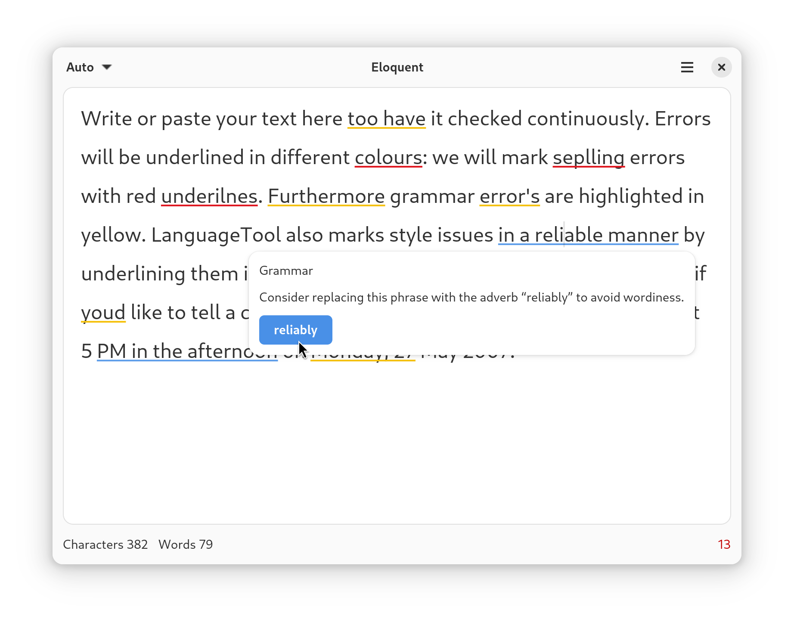

# Eloquent

Your proofreading assistant

Eloquent is a proofreading software for English, Spanish, French, German, Portuguese, Polish, Dutch, and more than 20 other languages. It finds many errors that a simple spell checker cannot detect.

It works fully offline, powered by [LanguageTool standalone server](https://github.com/languagetool-org/languagetool/tree/master/languagetool-standalone).



<a href='https://flathub.org/apps/re.sonny.Eloquent'></a>

<!--
## Development

```sh
cd Eloquent
npm install
make dev
```

Make changes and press `<Primary><Shift>Q` on the Eloquent window to restart it.

Use `<Primary><Shift>I` to open the inspector.

```
java -cp LanguageTool-6.5/languagetool-server.jar org.languagetool.server.HTTPServer --port 8081
```

-->

## Maintainer

<details>
  <summary>Bookmarks</summary>

- [Flathub](https://flathub.org/apps/re.sonny.Eloquent)
- [Flathub repo](https://github.com/flathub/re.sonny.Eloquent)
- [Flathub builds](https://flathub.org/builds/#/apps/re.sonny.Eloquent)
- [Flathub stats](https://klausenbusk.github.io/flathub-stats/#ref=re.sonny.Eloquent)
- [Flathub API](https://flathub.org/api/v1/apps/re.sonny.Eloquent)
</details>

<details>

  <summary>i18n</summary>

```sh
# To update the pot file
# xgettext -f po/POTFILES -o po/re.sonny.Eloquent.pot --no-wrap -cTRANSLATORS --from-code=UTF-8
# sed -i "s/Project-Id-Version: PACKAGE VERSION/Project-Id-Version: re.sonny.Eloquent/" po/re.sonny.Eloquent.pot
meson compile re.sonny.Eloquent-pot -C build


# To create a translation
# msginit -i po/re.sonny.Eloquent.pot -o po/fr.po -l fr_FR.UTF-8
echo -n " fr" >> po/LINGUAS
meson compile re.sonny.Eloquent-update-po -C build

# To update translations
# msgmerge -U po/*.po po/re.sonny.Eloquent.pot
meson compile re.sonny.Eloquent-update-po -C build
```

See https://github.com/sonnyp/Commit/pull/14#issuecomment-894070878

</details>

<details>

<summary>Publish new version</summary>

- update metainfo and screenshot
- `meson compile re.sonny.Eloquent-pot -C build`
- `meson compile re.sonny.Eloquent-update-po -C build`
- Update version in `meson.build`
- git tag
- flathub

</details>

## Copyright

© 2025 [Sonny Piers](https://github.com/sonnyp)

## License

GPLv3. Please see [COPYING](COPYING) file.

## Notes

Grammer checker

- https://github.com/btford/write-good (en)
- https://grammalecte.net/ (fr)
- https://github.com/languagetool-org/languagetool (multi)
- https://1.6km.me/blog/2021/03/30/the-poor-mans-grammar-checker/

NLP

- https://web.archive.org/web/20230321055642/https://www.abisource.com/projects/link-grammar/
- https://naturalnode.github.io/natural/
